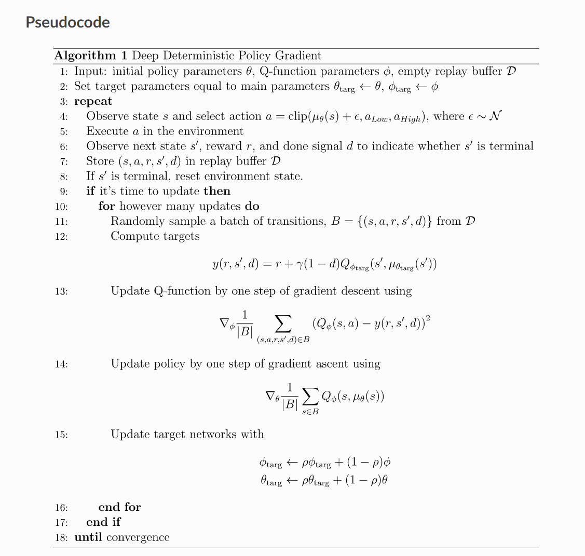
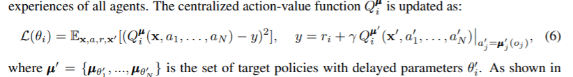

# DRL - Collaboration And Competition

[//]: # (Image References)


# Project 3: Collaboration and Competition

### Algorithm

For this project I implemented a variant of the Multi-Agent Deep Deterministic Policy Gradient (MADDPG) algorithm as described in the paper: [Multi-Agent Actor-Critic for Mixed
Cooperative-Competitive Environments](https://proceedings.neurips.cc/paper/2017/file/68a9750337a418a86fe06c1991a1d64c-Paper.pdf)

MADDPG is an extension of Deep Deterministic Policy Gradient (DDPG) algorithm described in the paper: [Continuous Control With Deep Reinforcement Learning](https://arxiv.org/abs/1509.02971)

We used DDPG in Project #2 when we were training a single agent in a continous action space.  In project #3, we are training two agents that need to act in collaborative manner.  MADDPG is well-suited for this latter use case.  It extends DDPG by modifying the data available to the critic during training such that the critic can know the actions performed by <b>all</b> agents at each step:

> We adopt the framework of centralized training with decentralized execution, allowing the policies
> to use extra information to ease training, so long as this information is not used at test time. It is
> unnatural to do this with Q-learning without making additional assumptions about the structure of the
> environment, as the Q function generally cannot contain different information at training and test
> time. Thus, we propose a simple extension of actor-critic policy gradient methods where the critic is
> augmented with extra information about the policies of other agents, while the actor only has access
> to local information. After training is completed, only the local actors are used at execution phase,
> acting in a decentralized manner and equally applicable in cooperative and competitive settings. This
> is a natural setting for multi-agent language learning, as full centralization would not require the
> development of discrete communication protocols.

The extra information is only used by the critic during training.  The inference performed by the actor (to select actions) uses the same local observations as DDPG.  

The multi-agent decentralized actor, centralized critic approach can be seen in this figure from the paper:


See how more than one green arrow is input to each critic?  That's the <b>key</b> extension going from DDPG to MADDPG (and from project #2 to #3).

#### Modfications

For project #2, I came upon a modification to the original DDPG at [OpenAI Spinning Up](https://spinningup.openai.com/en/latest/algorithms/ddpg.html)

This implementation incorporated the following key features that yielded immediate improvements:
* A learning step to better control the update of the networks relative to the amount of experiences collected
* Gradient clipping in the critic network
* A decay term to gradually reduce the introduction of noise as training progresses

For this project, we modified the decay, to put a limit on the number of episodes for which exploration will be allowed.

The pseudo-code from Spinning Up is as follows:



This excerpt from the MADDPG paper shows how the DDPG loss is modified with a critic that accepts input from multiple actions:


> 


### Implementation

The code used for this project is heavily based on the solution in the Udacity Deep Reinforcement Learning github repo, specifically the [ddpg-pedal solution](https://github.com/udacity/deep-reinforcement-learning/tree/master/ddpg-bipedal).

The key components are as follows:

#### model.py:
This file contains the network classes for the Actor and the Critic.  The networks use rectified non-linearity (ReLU activation) for all the hidden layers.  The final output layer of the actor used tanh activation to keep the actions bounded.  Both networks have default hidden layers of 256 and 128.  Both networks apply Batch Normalization after the first hidden layer.  For the Critic, the actions aren't input to the network until the second hidden layer.  The implemenation is nearly an exact match of the description found in Section 7 (Experiment Details) of the Continuous Control paper.

#### maddpg_agent.py:
This file contains three classes.  The Agent class is the main interface for interacting with and learning from the enviroment.  The Agent delegates to the ReplayBuffer class to store the experience tuples needed for experience replay.  The third class, OUNoise, uses the Ornstein-Uhlenbeck process to promote exploration in the actions chosen as the Agent moves through the environment.  The key methods are described below.

##### Agent.__init__
A key feature of this constructor is that it instantiates two networks for the Actor and the Critic (4 total), a local and a target.  While the local is being trained, the target is used to generate stable targets for computing the loss.  In both cases, the weights of the target networks are updated by having them slowly track the learned local network.  More on this later.  In addition to the networks, this method initializes the ReplayBuffer and the OUNoise object.  It also establishes the linear noise decay step that will be applied during learning.
##### Agent.act
This method returns actions, according to this single policy, for as many input states we wish to pass in (one per agent).  For <b>this</b> project, we will only be calling this method for one agent at a time, because the shape of the input states is (1,48), and the output action is (1,2).  To encourage exploration, the action predicted by the actor_local newtwork has noise added to it.  The amount of noise will decrease as training progresses.  Lastly, the action is clipped to remain within bounds.
##### Agent.step
The training loop will choose an action and provide it to the enviroment.  With the environment's response, we have a full experience (state, action, reward, next_state, done) that can be stored in the ReplayBuffer.  For every LEARN_EVERY calls to Agent.step, the method will do the following steps LEARN_NUMBER times: sample BATCH_SIZE samples from the ReplayBuffer and update the Actor and Critic networks by calling Agent.learn.
##### Agent.learn
This method implements steps 12-15 from the algorithm pseudo-code.  One modification is gradient clipping applied to the critic as it is updating.  The updated local networks are used to gradually soft update (based on interpolation parameter TAU) the target networks.
##### Agent.soft_update
Allows the target networks to slowly track the parameters of the learned newtorks based on the interpolation factor TAU.  Makes the learn process much more stable.

#### Tennis.ipynb
The maddpg() method in the notebook is the main training loop.  It uses Agent.act to ...

### Hyperparameters
The following hyperparameter settings were used:
```
BUFFER_SIZE = int(1e6)  # replay buffer size
BATCH_SIZE = 128        # minibatch size
LR_ACTOR = 1e-3         # learning rate of the actor
LR_CRITIC = 1e-3        # learning rate of the critic
WEIGHT_DECAY = 0        # L2 weight decay
LEARN_EVERY = 1         # learning timestep interval
LEARN_NUM = 1           # number of learning passes
GAMMA = 0.99            # discount factor
TAU = 7e-2              # for soft update of target parameters
OU_SIGMA = 0.2          # Ornstein-Uhlenbeck noise parameter, volatility
OU_THETA = 0.12         # Ornstein-Uhlenbeck noise parameter, speed of mean reversion
EPS_START = 5.5         # initial value for epsilon in noise decay process in Agent.act()
EPS_EP_END = 250        # episode to end the noise decay process
EPS_FINAL = 0           # final value for epsilon after decay
```
The model architecture for the neural network is described above in the model.py section.

### Plot of Rewards

### Ideas for Future Work

#### Hyperparameter Tuning

#### Network Architecture

what else????
